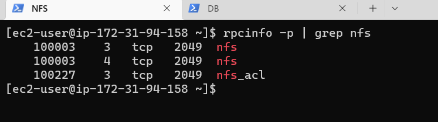
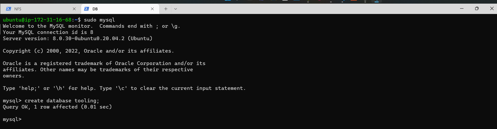
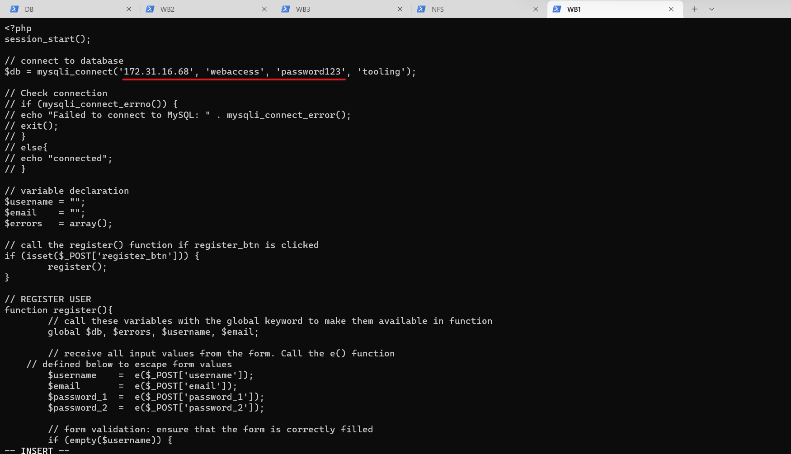

# Project 7: Devops Tooling Website Solution

## Prepare NFS server

First spin up 4 EC2 instances of red hat servers and name them NFS, Webserver1, Webserver2 and Webserver3. Then create an EC2 ubuntu server for the database:

Next is creating logical volumes.

Create partitions for xvdf xvdg and xvdh similiar to project 6:

`sudo gdisk /dev/xvdf`

`sudo gdisk /dev/xvdg`

`sudo gdisk /dev/xvdh`

Use pvcreate utility to mark each of 3 disks as physical volumes to be used by LVM using these codes:

`sudo pvcreate /dev/xvdf1`
`sudo pvcreate /dev/xvdg1`
`sudo pvcreate /dev/xvdh1`

Use vgcreate utility to add all 3 PVs to a volume group (VG). Name the VG webdata-vg. Use lvcreate utility to create 3 logical volumes. lv-apps, lv-logs and lv-optL: 

`sudo vgcreate webdata-vg /dev/xvdh1 /dev/xvdg1 /dev/xvdf1`

`sudo lvcreate -n lv-apps -L 9G webdata-vg`
`sudo lvcreate -n lv-logs -L 9G webdata-vg`

Use mkfs.xfs to format the logical volumes with xfs filesystem:

`sudo mkfs -t xfs /dev/webdata-vg/lv-apps`
`sudo mkfs -t xfs /dev/webdata-vg/lv-logs`
`sudo mkfs -t xfs /dev/webdata-vg/lv-opt`

Create dirs where they will be mounted as shown in the image:

Install NFS server, configure it to start on reboot and make sure it is u and running:

`sudo yum -y update`
`sudo yum install nfs-utils -y`
`sudo systemctl start nfs-server.service`
`sudo systemctl enable nfs-server.service`
`sudo systemctl status nfs-server.service`

Make sure to set up permission that will allow our Web servers to read, write and execute files on NFS:

`sudo chown -R nobody: /mnt/apps`
`sudo chown -R nobody: /mnt/logs`
`sudo chown -R nobody: /mnt/opt`

`sudo chmod -R 777 /mnt/apps`
`sudo chmod -R 777 /mnt/logs`
`sudo chmod -R 777 /mnt/opt`

`sudo systemctl restart nfs-server.service`

Configure access to NFS for clients within the same subnet (172.31.80.0/20):

`sudo vi /etc/exports`

Input code as shown into that:

<!-- /mnt/apps 172.31.80.0/20(rw,sync,no_all_squash,no_root_squash)
/mnt/logs 172.31.80.0/20(rw,sync,no_all_squash,no_root_squash)
/mnt/opt 172.31.80.0/20(rw,sync,no_all_squash,no_root_squash) -->

then:

`sudo exportfs -arv`

Check which port is used by NFS and open it using Security Groups (add new Inbound Rule):

`rpcinfo -p | grep nfs`

In order for NFS server to be accessible from your client, you must also open following ports: TCP 111, UDP 111, UDP 2049 as shown in the image

## Configure the database server

Carry out the following:

Install MySQL server
Create a database and name it tooling
Create a database user and name it webaccess
Grant permission to webaccess user on tooling database to do anything only from the webservers subnet cidr

`sudo apt update`

`sudo yum install mysql-server`

Create DB and user with privileges:

Install NFS client on the Webservers:

`sudo yum install nfs-utils nfs4-acl-tools -y`

Mount /var/www/ and target the NFS server’s export for apps:

`sudo mkdir /var/www`

`sudo mount -t nfs -o rw,nosuid <NFS-Server-Private-IP-Address>:/mnt/apps /var/www`

Edit /etc/fstab:

`sudo vi /etc/fstab`

Add the line `<NFS-Server-Private-IP-Address>:/mnt/apps /var/www nfs defaults 0 0`:

Install Remi’s repository, Apache and PHP:

`sudo yum install httpd -y`

`sudo dnf install https://dl.fedoraproject.org/pub/epel/epel-release-latest-8.noarch.rpm`

`sudo dnf install dnf-utils http://rpms.remirepo.net/enterprise/remi-release-8.rpm`

`sudo dnf module reset php`

`sudo dnf module enable php:remi-7.4`

`sudo dnf install php php-opcache php-gd php-curl php-mysqlnd`

`sudo systemctl start php-fpm`

`sudo systemctl enable php-fpm`

`sudo setsebool -P httpd_execmem 1`

Make sure to repeat those steps for the other 2 Webservers

Verify that Apache files and directories are available on the Web Server in /var/www and also on the NFS server in /mnt/apps. If you see the same files – it means NFS is mounted correctly. You can try to create a new file touch test.txt from one server and check if the same file is accessible from other Web Servers:

Locate the log folder for Apache on the Web Server and mount it to NFS server’s export for logs. Make sure the mount point will persist after reboot:

Fork the tooling source code from:

https://github.com/darey-io/tooling.git

Deploy the tooling website’s code to the Webserver. Ensure that the html folder from the repository is deployed to /var/www/html:

Now disable SELinux with `sudo setenforce 0`

To make this change permanent – open following config file `sudo vi /etc/sysconfig/selinux` and set SELINUX=disabled then restrt httpd.

Update the website’s configuration to connect to the database (in /var/www/html/functions.php file):

Apply tooling-db.sql script to your database using this command (make sure to be in the tooling dir):

`mysql -h <databse-private-ip> -u <db-username> -p <db-pasword> < tooling-db.sql`

Create in MySQL a new admin user with username: myuser and password: password:

<!-- INSERT INTO `users` (
    `id`,
    `username`,
    `password`,
    `email`,
    `user_type`,
    `status`
  )
VALUES (
    2,
    'myuser',
    '5f4dcc3b5aa765d61d8327deb882cf99',
    'user@mail',
    'admin',
    '1'
  ); -->
  

Make sure to edit the bind-address:

`sudo vi /etc/mysql/mysql.conf.d/mysqld.cnf`

Edit inbound rule to access mysql:

Open the website in your browser http://<Web-Server-Public-IP-Address-or-Public-DNS-Name>/index.php and make sure you can login into the websute with myuser user:

Done